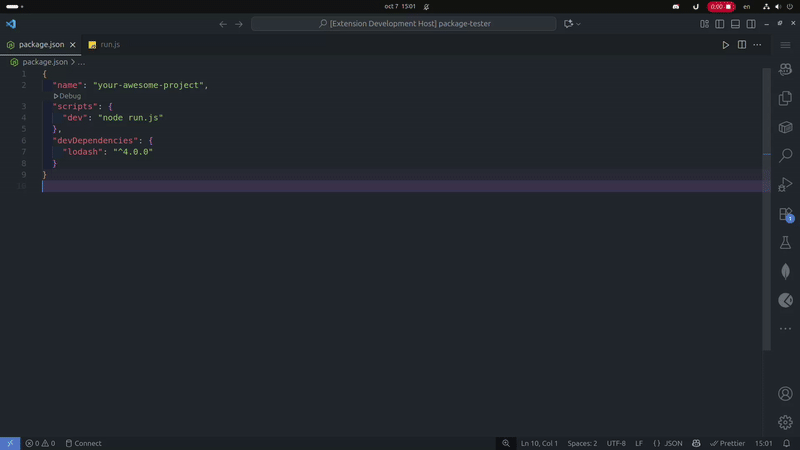
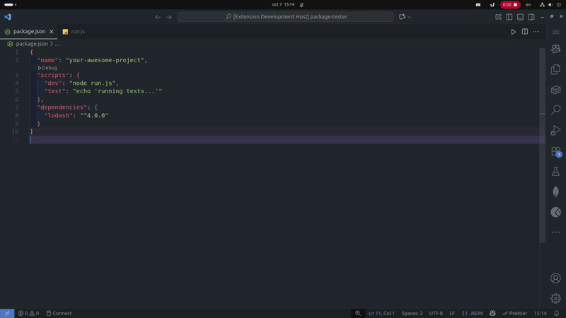

# Node Project Manager Extension

A powerful VS Code extension for managing Node.js projects with enhanced package management, script execution, and multi-package-manager support.

## 🚀 Features

### 📦 Multi-Package Manager Support
- **Automatic Detection**: Intelligently detects your package manager based on lock files
- **Support for**: npm, yarn, pnpm, and bun
- **Smart Commands**: Uses the appropriate commands for your detected package manager

### 🎯 Enhanced Script Management
- **Interactive Script Selection**: Beautiful QuickPick interface with icons and descriptions
- **Script Execution**: Run scripts directly from the command palette
- **Add Custom Scripts**: Easily add new scripts to your package.json
- **Input Validation**: Comprehensive validation for script names and commands

### 🔧 Dependency Management
- **Install Dependencies**: Add production and development dependencies
- **Remove Dependencies**: Clean removal with proper validation
- **Update Dependencies**: Keep your packages up to date
- **Dependency Auditing**: Security audit capabilities
- **Smart Installation**: Installs all dependencies with one command

### ✨ User Experience Improvements
- **Progress Indicators**: Visual feedback during operations
- **Error Handling**: Comprehensive error messages and validation
- **Keyboard Shortcuts**: Quick access with `Ctrl+Alt+N` (or `Cmd+Alt+N` on Mac)
- **Context Menu**: Right-click on package.json for quick access
- **Logging System**: Detailed logging for troubleshooting

## 📋 Commands

| Command | Description | Keyboard Shortcut |
|---------|-------------|-------------------|
| `Node Project Manager: Open Node Project Manager` | Opens the main project manager | `Ctrl+Alt+N` |
| `Node Project Manager: Use Project Scripts` | Execute project scripts | - |
| `Node Project Manager: Install Project Dependencies` | Install all dependencies | - |
| `Node Project Manager: Add Dependency` | Add a production dependency | - |
| `Node Project Manager: Add Dev Dependency` | Add a development dependency | - |
| `Node Project Manager: Remove Dependency` | Remove a dependency | - |
| `Node Project Manager: Update Dependency` | Update a dependency | - |
| `Node Project Manager: Audit Dependencies` | Run security audit | - |
| `Node Project Manager: Add Script` | Add a new script | - |

## ⚙️ Configuration

Configure the extension in your VS Code settings:

```json
{
  "nodeProjectManager.packageManager": "npm", // npm, yarn, pnpm, bun
  "nodeProjectManager.showTerminal": true,     // Show terminal when running commands
  "nodeProjectManager.confirmActions": true    // Ask for confirmation before destructive actions
}
```

## 🎬 Usage Examples

### Add and Use Project Scripts


### Install Dependencies


### Add Dependencies


### Remove Dependencies


### Add Development Dependencies


### Update Dependencies


## 🛠️ Development

### Prerequisites
- Node.js 16+
- VS Code 1.74.0+

### Setup
```bash
# Clone the repository
git clone https://github.com/Marcosreuquen/node-project-manager.git

# Install dependencies
npm install

# Compile the extension
npm run compile

# Run tests
npm test

# Watch mode for development
npm run watch
```

### Code Quality
```bash
# Run linting
npm run lint

# Fix linting issues
npm run lint:fix

# Format code
npm run format

# Check formatting
npm run format:check

# Run all quality checks
npm run quality

# Run quality checks and fix issues
npm run quality:fix
```

### Testing
```bash
# Run tests
npm test

# Run tests in watch mode
npm run test:watch

# Run tests with coverage
npm run test:coverage
```

## 🏗️ Architecture

### Core Components
- **Controllers**: Handle specific functionality (scripts, dependencies, terminal)
- **Managers**: Orchestrate operations (CommandManager)
- **Utils**: Shared utilities (validation, package manager detection, logging)

### Key Features
- **Automatic Package Manager Detection**: Detects npm, yarn, pnpm, or bun based on lock files
- **Input Validation**: Comprehensive validation for package names and scripts
- **Error Handling**: Graceful error handling with user-friendly messages
- **Logging System**: Detailed logging for debugging and monitoring

## 🤝 Contributing

1. Fork the repository
2. Create a feature branch: `git checkout -b feature/amazing-feature`
3. Commit your changes: `git commit -m 'Add amazing feature'`
4. Push to the branch: `git push origin feature/amazing-feature`
5. Open a Pull Request

## 📝 License

This project is licensed under the MIT License - see the [LICENSE](LICENSE) file for details.

## 👨‍💻 Author

**Marcos Reuquen Diaz**
- Website: [marcosdiaz.dev](https://marcosdiaz.dev)
- GitHub: [@Marcosreuquen](https://github.com/Marcosreuquen)
- Email: marcosreuquendiaz@gmail.com

## 🙏 Acknowledgments

- VS Code team for the excellent extension API
- Node.js community for amazing package managers
- Contributors and users of this extension
