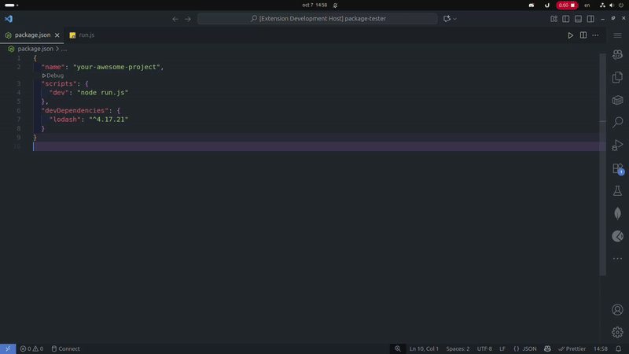
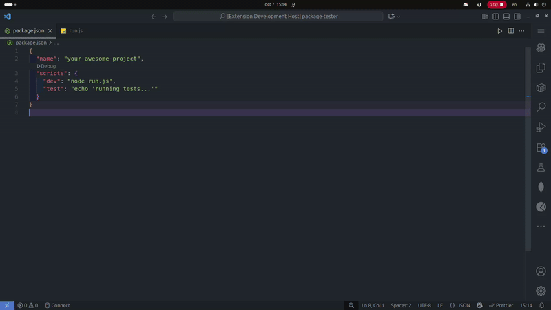
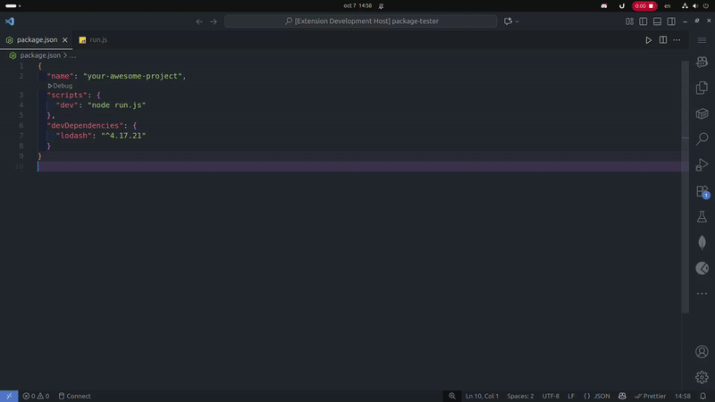
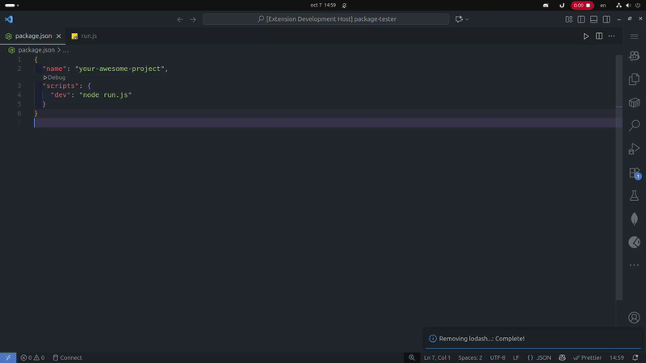

# Node Project Manager Extension

this is a simple extension to manage node projects, it will extract and display the scripts in the package.json file in the workspace and allow you to run them in the terminal using the command palette, and you can also add scripts to the package.json file. In addition, you can manage the dependencies in the package.json file adding, removing and updating them.

# Usage

### Use project scripts

### Add a new script to project

### Install project dependencies

### Install a dependency

### Remove a dependency

### Install a development dependency

